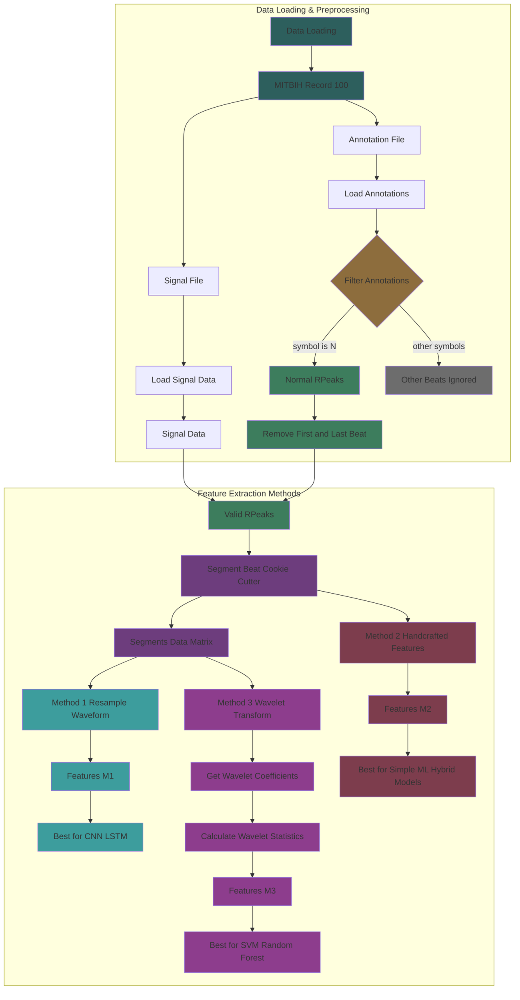

# ECG Arrhythmia Preprocessing Workflow

This diagram shows the complete data processing pipeline from raw MIT-BIH data to feature extraction.

```mermaid
graph TB
    subgraph "Data Loading & Preprocessing"
        A[Data Loading] --> B[MITBIH Record 100]
        B --> C[Signal File]
        C --> D[Load Signal Data]
        D --> E[Signal Data]
        
        B --> F[Annotation File]
        F --> G[Load Annotations]
        G --> H{Filter Annotations}
        
        H -->|symbol is N| I[Normal RPeaks]
        H -->|other symbols| J[Other Beats Ignored]
        
        I --> K[Remove First and Last Beat]
    end
    
    subgraph "Feature Extraction Methods"
        K --> L[Valid RPeaks]
        E --> L
        
        L --> M[Segment Beat Cookie Cutter]
        M --> N[Segments Data Matrix]
        
        N --> O[Method 1 Resample Waveform]
        O --> P[Features M1]
        P --> Q[Best for CNN LSTM]
        
        M --> R[Method 2 Handcrafted Features]
        R --> S[Features M2]
        S --> T[Best for Simple ML Hybrid Models]
        
        N --> U[Method 3 Wavelet Transform]
        U --> V[Get Wavelet Coefficients]
        V --> W[Calculate Wavelet Statistics]
        W --> X[Features M3]
        X --> Y[Best for SVM Random Forest]
    end
    
    style A fill:#2d5f5d
    style B fill:#2d5f5d
    style I fill:#3d7d5d
    style K fill:#3d7d5d
    style L fill:#3d7d5d
    style J fill:#6d6d6d
    style M fill:#6d3d7d
    style N fill:#6d3d7d
    style O fill:#3d9d9d
    style P fill:#3d9d9d
    style Q fill:#3d9d9d
    style R fill:#7d3d4d
    style S fill:#7d3d4d
    style T fill:#7d3d4d
    style U fill:#8d3d8d
    style V fill:#8d3d8d
    style W fill:#8d3d8d
    style X fill:#8d3d8d
    style Y fill:#8d3d8d
    style H fill:#8d6d3d
```
